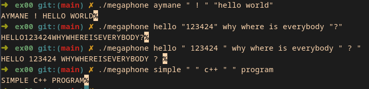
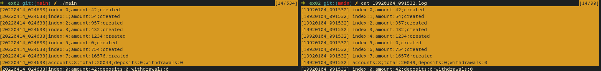

# CPP_00
This cpp module introduces the following topics: Namespaces, classes, member functions, stdio streams, initialisization lists, static, const, and some others basic stuff.

## Table of contents
* [ex00](#ex00)
* [ex01](#ex01)
* [ex02](#ex02)

## ex00
This program, converts arguments from the command line to UpperCase.

## ex01
This program will have an interactive shell interface, a phonebook, where you can add new contacts, and display them. Each contact contain: first name, last name, nick name, phone number, darkest secret.

This program has the following commands:
- ADD : to add a new contact.
- SEARCH : to display current contacts.
- EXIT : to exit the program.

## ex02
In this exercice, from a log and header file. We need to implement the Account.cpp file that the dev team deleted it by accident, and to make sure everything is correct. We need to get the same output as the log file except for the timestamps.

